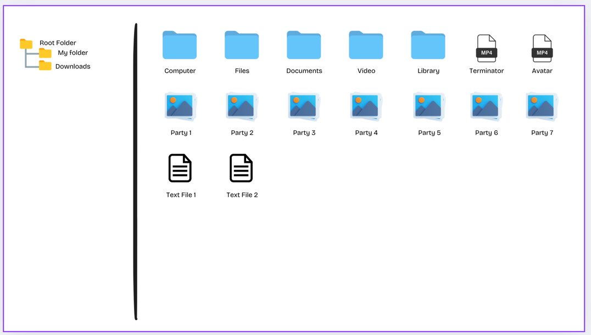

## The File Manager API
This is an API for File Manager App. It's allow users to upload file, upload file by chunks, create folders, see content of specific folder.



## Installation

```bash
$ npm install
```

## Running the app

```bash
# development
$ npm run start

# watch mode
$ npm run start:dev

# production mode
$ npm run start:prod
```
## API Documentation
 The app uses Swagger for API documentation. You can access the documentation by visiting the following URL in your browser: http://localhost:3000/api

